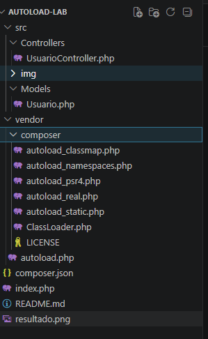

# Laboratorio PSR-4 con Composer

## Descripción

Proyecto desarrollado para implementar el estándar PSR-4 utilizando Composer en PHP.

El laboratorio demuestra el uso de carga automática (Autoload) mediante Namespaces, eliminando la necesidad de utilizar include o require manualmente en cada archivo del sistema.


# Tecnologías utilizadas

- PHP 8
- Composer
- PSR-4
- Git & GitHub


# Estructura del Proyecto


# Namespaces Utilizados

| Namespace | Ruta Física |
|---|---|
| JosephSiso\AutoloadLab\Models | src/Models |
| JosephSiso\AutoloadLab\Controllers | src/Controllers |


# Configuración de Composer

## composer.json

```json
{
    "name": "JosephSiso/autoload-lab",
    "description": "Laboratorio PSR-4",
    "autoload": {
        "psr-4": {
            "JosephSiso\\AutoloadLab\\": "src/"
        }
    },
    "authors": [
        {
            "name": "Joseph Siso"
        }
    ],
    "require": {}
}
```


# Instalación del Proyecto

## 1. Clonar el repositorio

```bash
git clone URL_DEL_REPOSITORIO
```
## 2. Entrar al proyecto

```bash
cd autoload-lab
```


## 3. Generar el autoload

```bash
composer dump-autoload
```


# Ejecución

Ejecutar el siguiente comando:

```bash
php index.php
```


# Resultado esperado

```plaintext
Hola desde Usuario
```


# Evidencias de Autoload

## Uso del autoload de Composer

```php
require 'vendor/autoload.php';
```

## Uso de Namespace

```php
namespace JosephSiso\AutoloadLab\Models;
```

---

## Uso de la palabra reservada use

```php
use JosephSiso\AutoloadLab\Models\Usuario;
```

---

# Conclusiones Técnicas

## 1. Mantenibilidad

El estándar PSR-4 permite agregar nuevas clases al sistema sin necesidad de modificar archivos globales ni agregar include manualmente.

---

## 2. Eficiencia de memoria

Las clases son cargadas únicamente cuando son utilizadas, aplicando el concepto de Lazy Loading y mejorando el rendimiento.

---

## 3. Estandarización

El uso de PSR-4 facilita el trabajo colaborativo y mantiene una estructura profesional y organizada dentro del proyecto.

---

# Higiene del Repositorio

El proyecto utiliza un archivo `.gitignore` para excluir la carpeta `vendor/`, permitiendo que las dependencias se generen localmente mediante Composer.

## .gitignore

```plaintext
/vendor
```

---

# Autor

Joseph Siso  
Desarrollo de Software VII  
Universidad Tecnológica de Panamá
